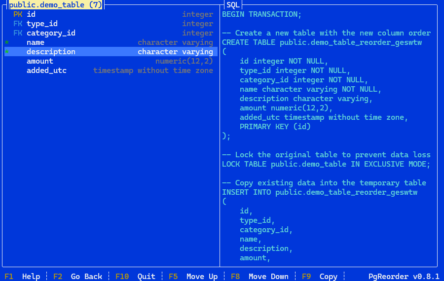

## PgReorder

Postgres itself [does not currently support column reordering](https://wiki.postgresql.org/wiki/Alter_column_position). New columns are always added at the end of the existing list of columns. While this technically does not matter, for those us who like to have columns ordered in a certain way PgReorder can help generate the required DDLs to reorder the columns.

PgReorder takes the approach of [recreating the entire table](https://wiki.postgresql.org/wiki/Alter_column_position). The other suggested approach of adding new columns and moving data around is not currently supported, but it may be in the future.

### Console UI

PgReorder offers a [terminal / console GUI](https://github.com/gui-cs/Terminal.Gui) that allows you to navigate schemas, tables, and of course the list of columns from a table. One you are in the list of columns view (see below), you can

* Select one or more columns using the `space` key and move them with `Ctrl+Up|Down` or `Alt+Up|Down`, or
* Move the currently selected column using `Ctrl+Up|Down` or `Alt+Up|Down` on your keyboard.
* You can also change the selection using `+` (select all), `-` (unselect all), or `*` (toggle selection)
* If `Ctrl+Up|Down` or `Alt+Up|Down` do not work (depends on the console you are using), you can also use `F5` or `F8` to move.

In the screenshot below, `name` and `description` are selected.



### Copy the DDL

As soon as you move at least one column, the right side of the application will show the DDL you would need to run to get the same order of columns. You can copy the entire DDL with `Ctrl+C` while in the column list or SQL view.

### How to connect

With the current version, the application must have a direct path to connect to the database. If your network setup requires an SSH connection, you will have to build a tunnel to the database before starting the application.

There are two ways to pass the required connection information:

1) By passing a single connection string (using [this format](https://www.connectionstrings.com/npgsql/)) 

```
pgreorder --cs "Server=localhost;Port=5000;User Id=my_user;Password=my_password;Database=my_database;"
```

2) Pass each individual parameter

```
pgreorder --host localhost --port 5000 --user my_user --password my_password --database my_database
```

### Limitations

Please make sure to examine the generated DDL carefully, and if possible, run it first on a development instance. While PgReorder does try to recreate the table as it was before the movement operation, your configuration may not be supported. If you came across such a scenario, please open an issue with details on how to reproduce it.

Here is what should work:

* The primary key should be re-created with the prior names
* All foreign keys re-created with the prior names
* Sequences reset to the proper next value
* All indexes should be re-added
* Table and column comments should be preserved
* Table options should be part of the new table

What needs work / validation:

* Support for views
* Support for triggers